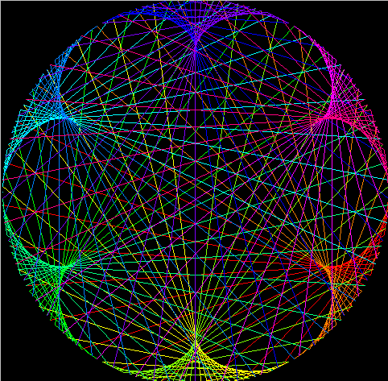

# cardioid

cardioid is a FOSS implementation of the Simon Plouffe and Mathologer
times table idea of generating beautiful graphic patterns, made in C and SDL2. 


# Running with different initial multipliers.
|Multiplier 2               | Multiplier 7                  | Multiplier 11
|:---:  		            | :---:    		                | :---:
|||

## Requirements

- Unix like system
- GCC or clang
- GNU make
- SDL2
- Standard libraries: stdbool, stdlib, stdint, errno, math (These should be already installed)

## Compiling, running and cleaning.
```sh
make                # 
make run            # ./cardioid
make clean          # rm sic objs/sic.o
```
## Options
press [SPACE] or [ENTER] to pause the frame.

- `-h,   --help                 → show this help message and exit`
- `-v,   --version              → show program's version number and exit`
- `-d,   --dots=NUM             → spaced dots at the circle: 200 by default`
- `-m,   --multiplier=NUM       → initial multiplier: 0 by default`
- `-i,   --mult_increase=NUM    → increase per frame: 0.005 by default`
- `-f,   --fps=NUM              → frames per second: 60 by default`

## Resources
[Simon Plouffe](https://plouffe.fr/articles/The%20shape%20ofb%20power%20n%20mod%20p.pdf)
[Mathologer](https://youtube.com/watch?v=qhbuKbxJsk8)

## Made by [Sivefunc](https://gitlab.com/sivefunc)
## Licensed under [GPLv3](LICENSE)
